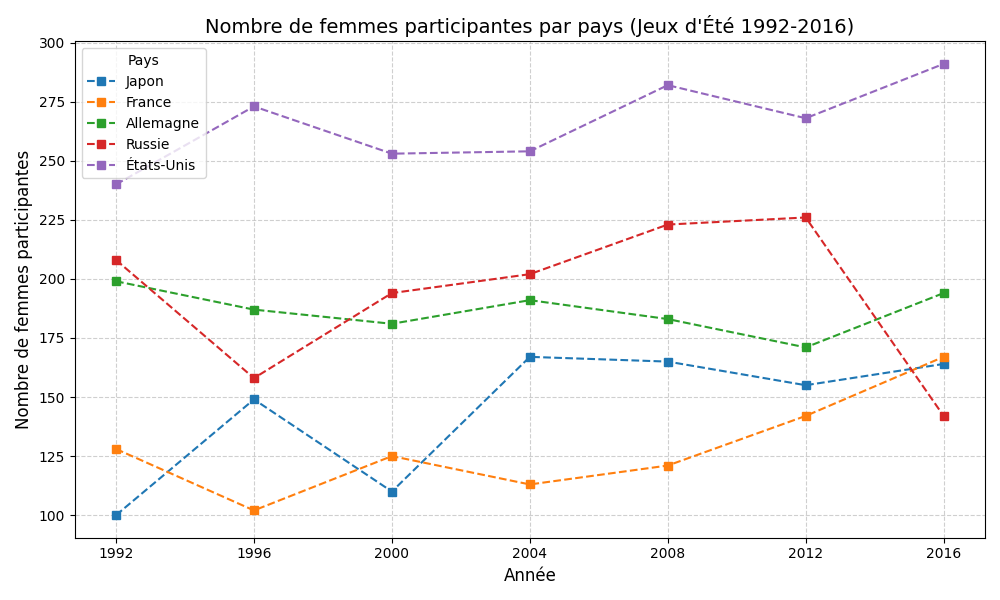
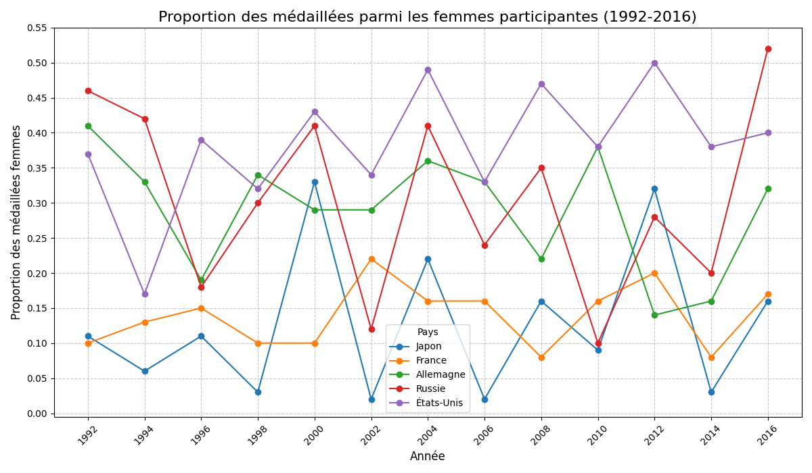
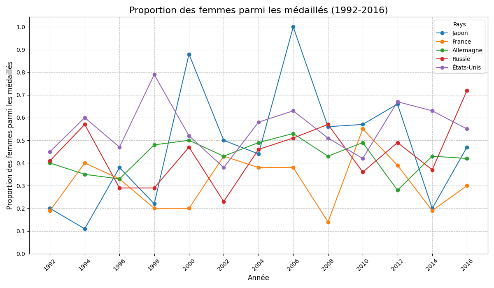

= Rapport d'Analyse Statistique des Jeux Olympiques
:author: Yann RENARD, Yanis MEKKI
:date: 19 mai 2025
:toc: true
:toc-title: Table des matières
:toclevels: 3
:sectnums:
:lang: fr-FR
:source-highlighter: rouge
:rouge-style: github
:icons: font
:pdf-theme: ./shadcnlike-theme.yml
:pdf-fontsdir: {pdf-themesdir}/fonts;GEM_FONTS_DIR
:title-page: true
:experimental: true
:stem:
:footnotes:
:xrefstyle: short
:page-break-before: sect2

== Introduction

Ce rapport analyse les données des Jeux Olympiques de 1992 à 2016, en se concentrant sur la participation des athlètes, les médailles obtenues et la représentation des femmes. Les analyses sont basées sur des requêtes SQL exécutées sur une base de données structurée, avec des visualisations adaptées, conformément aux exigences du sujet SAE 2.04 de Statistiques

'''

== Les 20 athlètes avec le plus de participations aux JO

Pour identifier les 20 athlètes ayant le plus participé aux JO, nous avons utilisé la requête SQL suivante :

[source,sql]
----
SELECT a.id, a.name, COUNT(*) AS nombre_participations
FROM performance p
JOIN athlete a ON p.id_athlete = a.id
GROUP BY a.id, a.name
ORDER BY nombre_participations DESC
LIMIT 20;
----

*Résultats :*

[source,text]
----
ID     | Nom                                 | Nombre de participations
--------|-------------------------------------|------------------------
106296 | Heikki Ilmari Savolainen            | 39
115354 | Joseph "Josy" Stoffel               | 38
89187  | Takashi Ono                         | 32
129196 | Andreas Wecker                      | 32
55047  | Alfred August "Al" Jochim           | 31
106156 | Johann "Hans" Sauter                | 31
76437  | Michel Mathiot                      | 31
94406  | Michael Fred Phelps II              | 30
133279 | Yordan Yovchev Yovchev              | 30
120051 | Karl Tore William Thoresson         | 30
21462  | Oksana Aleksandrovna Chusovitina    | 29
11951  | Ole Einar Bjrndalen                 | 27
45219  | Fabian Hambchen                     | 26
79523  | Georg "Georges" Miez                | 25
91845  | Gabriella Paruzzi                   | 25
18369  | Giovanni Carminucci                 | 24
17345  | Ivan aklec                          | 24
25270  | Ferdinand Dani                      | 24
12678  | Henri Louis Borio                   | 24
----

*Visualisation :*

image::charts/topsportifplusparticipations.png[Diagramme en barres des participations]

== Analyse des Jeux Olympiques d'Hiver 2006 à Turin

=== Tableau statistique

Nous avons compilé un tableau statistique pour les JO d'Hiver à Turin, détaillant l'âge moyen, le nombre d'athlètes, et la plage d'âge par pays. La requête SQL utilisée est :

[source,sql]
----
DROP TABLE IF EXISTS temp_stats;
CREATE TEMP TABLE temp_stats AS
    SELECT n.region AS pays, ROUND(AVG(p.age)) AS age_moyen, COUNT(DISTINCT p.id_athlete) AS nombre_athletes, MIN(p.age) AS age_min, MAX(p.age) AS age_max
    FROM performance p
    JOIN game g ON p.id_game = g.id
    JOIN noc n ON p.noc = n.noc
    WHERE g.year = 2006 AND g.season = 'Winter' AND p.age IS NOT NULL
    GROUP BY n.region
    ORDER BY pays;
COPY temp_stats TO 'turin_stats_2006.csv' WITH CSV HEADER;
----

*Résultats (extrait) :*

[source,text]
----
pays          | age_moyen | nombre_athletes | age_min | age_max
------------- | --------- | --------------- | ------- | -------
Albania       | 19        | 1               | 19      | 19
Algeria       | 24        | 2               | 20      | 33
Andorra       | 25        | 3               | 21      | 27
Argentina     | 24        | 9               | 20      | 44
Armenia       | 22        | 5               | 18      | 29
Australia     | 26        | 40              | 18      | 35
Austria       | 28        | 73              | 18      | 38
Azerbaijan    | 28        | 2               | 25      | 30
Belarus       | 27        | 28              | 18      | 39
Belgium       | 29        | 4               | 23      | 38
Bermuda       | 31        | 1               | 31      | 31
Bosnia        | 21        | 6               | 19      | 26
Brazil        | 27        | 9               | 22      | 38
Bulgaria      | 26        | 21              | 16      | 32
Canada        | 25        | 191             | 16      | 49
----

*Visualisations :*

* *Âge moyen par pays :* Un diagramme en barres présente l'âge moyen des athlètes pour chaque pays lors des JO de Turin 2006.

* *Nombre d'athlètes par pays :* Un diagramme en barres illustre le nombre d'athlètes ayant participé pour chaque pays.

* *Carte mondiale :* Une carte choroplèthe met en évidence l'âge moyen des athlètes par pays, permettant de visualiser les différences géographiques.

image::charts/age_moyen_carte_real.png[Carte choroplèthe de l'âge moyen par pays]

=== Comparaison de l'âge moyen des médaillés et des participants

Pour comparer l'âge moyen des médaillés et des participants (tous sexes confondus) aux JO de 2006, nous avons utilisé :

[source,sql]
----
SELECT 
    (SELECT ROUND(AVG(p2.age)) 
     FROM performance p2 
     JOIN game g2 ON p2.id_game = g2.id 
     WHERE g2.year = 2006 AND g2.season = 'Winter' AND p2.medal IS NOT NULL) AS age_moyen_medailles,
    (SELECT ROUND(AVG(p3.age)) 
     FROM performance p3 
     JOIN game g3 ON p3.id_game = g3.id 
     WHERE g3.year = 2006 AND g3.season = 'Winter' AND p3.age IS NOT NULL) AS age_moyen_participants;
----

*Résultats :*

[source,text]
----
Âge moyen des médaillés | Âge moyen des participants
----------------------- | --------------------------
27                      | 26
----

*Analyse :* L'âge moyen des médaillés (27 ans) est légèrement supérieur à celui des participants (26 ans). Cela pourrait suggérer qu'une expérience un peu plus grande est un léger avantage pour obtenir une médaille (la différence est tout de même négligeable). 
*Note :* Un diagramme de type boîte à moustaches pourrait être construit pour confirmer visuellement que la moyenne d'âge des médaillés et celle des participants sont effectivement proches.

=== Comparaison du poids moyen des médaillés et le poids moyen des participants

[source,sql]
----
SELECT p.sex,
    (SELECT ROUND(AVG(p2.weight)) FROM performance AS p2
    JOIN athlete AS a2 ON p2.id_athlete = a2.id
    JOIN game AS g2 ON p2.id_game = g2.id
    WHERE g2.year = 2006 AND g2.season = 'Winter' AND p2.medal IS NOT NULL AND
    p2.weight IS NOT NULL AND a2.sex = p.sex) AS poids_moyen_medailles,
    (SELECT ROUND(AVG(p3.weight)) FROM performance AS p3
    JOIN athlete AS a3 ON p3.id_athlete = a3.id
    JOIN game AS g3 ON p3.id_game = g3.id
    WHERE g3.year = 2006 AND g3.season = 'Winter' AND p3.weight IS NOT NULL AND
    a3.sex = p.sex) AS poids_moyen_participants
FROM athlete p
GROUP BY p.sex
ORDER BY p.sex;
----

*Résultats :*

[source,text]
----
Sexe | Poids moyen des médaillés | Poids moyen des participants
---- | ------------------------- | ----------------------------
F    | 64                        | 60
M    | 80                        | 77
----

*Analyse :* Les athlètes médaillés, hommes et femmes, sont en moyenne légèrement plus lourds que les autres participants. Les médaillées pèsent en moyenne 4 kg de plus que les participantes, et les médaillés 3 kg de plus que les participants. Un poids plus élevé semble donc être un léger avantage possiblement dans les sports qui nécéssite une puissance plutôt importante.

image::charts/comparaisonpoidsmoyenhf.png[Comparaison poids moyen entre les hommes et les femmes]

'''

== La place des femmes dans les JO

=== Les 15 pays avec le plus de médailles cumulées (1992–2006)

Pour lister les 15 pays ayant remporté le plus de médailles entre 1992 et 2006, nous avons utilisé :

[source,sql]
----
SELECT n.region AS pays, COUNT(p.medal) AS nombre_medailles
FROM performance p
JOIN noc n ON p.noc = n.noc
JOIN game g ON p.id_game = g.id
WHERE p.medal IS NOT NULL AND g.year BETWEEN 1992 AND 2016
GROUP BY n.region
ORDER BY nombre_medailles DESC
LIMIT 15;
----

*Résultats :*

[source,text]
----
pays        | nombre_medailles
----------- | ----------------
USA         | 2181
Russia      | 1427
Germany     | 1268
Australia   | 889
China       | 867
Canada      | 742
Italy       | 602
France      | 582
UK          | 564
Netherlands | 519
South Korea | 491
Japan       | 481
Norway      | 387
Spain       | 386
Sweden      | 364
----

*Visualisation :* Un diagramme en barres horizontales met en évidence la domination des États-Unis, suivis de la Russie et de l'Allemagne.

image::charts/nombretotalmedaillesparpays.png[Nombre total de médailles par pays]

=== Analyse de cinq pays sélectionnés

Nous avons analysé les États-Unis, la Chine, le Japon, la Russie et la France sur plusieurs critères.

==== Évolution du nombre de participants

*Requête SQL :*

[source,sql]
----
SELECT g.year, n.region AS pays, COUNT(DISTINCT p.id_athlete) AS nombre_participants
FROM performance p
JOIN game g ON p.id_game = g.id
JOIN noc n ON p.noc = n.noc
WHERE n.region IN ('USA', 'France', 'Germany', 'Russia', 'Japan') AND g.year BETWEEN 1992 AND 2016
GROUP BY g.year, n.region
ORDER BY g.year, n.region;
----

*Résultats (extrait) :*

[source,text]
----
Année | Japon | France | Allemagne | Russie | États-Unis
----- | ----- | ------ | --------- | ------ | ----------
1992  | 56    | 68     | 205       | 235    | 197
1994  | 9     | 10     | 31        | 28     | 15
1996  | 42    | 45     | 108       | 97     | 227
...   | ...   | ...    | ...       | ...    | ...
2012  | 76    | 74     | 87        | 129    | 201
2014  | 10    | 16     | 28        | 49     | 60
2016  | 57    | 93     | 150       | 103    | 211
----

*Analyse :* Une courbe montre une participation plus élevée aux JO d'été. En 1992 (été), les États-Unis (693 participants) et la Russie (604) présentent les plus grandes délégations, suivis par l'Allemagne (574). La France (448) et le Japon (315) ont également une participation significative. Aux Jeux d'hiver de 1994, les chiffres sont naturellement plus bas, avec les États-Unis en tête (148). Pour les Jeux d'hiver de 2006, les États-Unis (204) mènent à nouveau, suivis par la Russie (174) et l'Allemagne (155). En 2016 (été), les États-Unis maintiennent leur leadership avec 555 participants, suivis par l'Allemagne (418) et la France (392), tandis que la Russie (284) connaît une baisse notable par rapport aux éditions précédentes.

image::charts/3bi.png[Évolution du nombre de participants]

==== Évolution du nombre de médaillés

*Requête SQL :*

[source,sql]
----
SELECT g.year, n.region AS pays, COUNT(DISTINCT p.id_athlete) AS nombre_medailles
FROM performance p
JOIN game g ON p.id_game = g.id
JOIN noc n ON p.noc = n.noc
WHERE n.region IN ('USA', 'France', 'Germany', 'Russia', 'Japan') AND p.medal IS NOT NULL AND g.year BETWEEN 1992 AND 2016
GROUP BY g.year, n.region
ORDER BY g.year, n.region;
----

*Résultats (extrait) :*

[source,text]
----
Année | Japon | France | Allemagne | Russie | États-Unis
----- | ----- | ------ | --------- | ------ | ----------
1992  | 56    | 68     | 205       | 235    | 197
1994  | 9     | 10     | 31        | 28     | 15
1996  | 42    | 45     | 108       | 97     | 227
...   | ...   | ...    | ...       | ...    | ...
2012  | 76    | 74     | 87        | 129    | 201
2014  | 10    | 16     | 28        | 49     | 60
2016  | 57    | 93     | 150       | 103    | 211
----

*Analyse :* Des courbes séparées pour les JO d'été et d'hiver montrent une nette supériorité du nombre de médaillés lors des éditions estivales. Pour les JO d'été, les États-Unis dominent généralement avec un pic de 263 médaillés en 2008, suivis par la Russie et l'Allemagne selon les éditions. Le Japon et la France montrent une progression, avec un bond pour la France en 2016 (93 médaillés). Pour les JO d'hiver, les États-Unis maintiennent leur avantage avec un maximum de 84 médaillés en 2010, tandis que l'Allemagne présente des performances stables. La Russie connaît une baisse en 2010 (22 médaillés) avant de remonter en 2014 (49). Le Japon reste le moins performant des cinq pays en hiver, avec seulement 1 médaillé en 2006.

==== Évolution du nombre de femmes participantes

*Requête SQL :*

[source,sql]
----
SELECT g.year, n.region AS pays, COUNT(DISTINCT p.id_athlete) AS nombre_femmes
FROM performance p
JOIN game g ON p.id_game = g.id
JOIN noc n ON p.noc = n.noc
JOIN athlete a ON p.id_athlete = a.id
WHERE n.region IN ('USA', 'France', 'Germany', 'Russia', 'Japan') AND a.sex = 'F' AND g.year BETWEEN 1992 AND 2016
GROUP BY g.year, n.region
ORDER BY g.year, n.region;
----

*Résultats (extrait) :*

[source,text]
----
Année | Japon | France | Allemagne | Russie | États-Unis
----- | ----- | ------ | --------- | ------ | ----------
1992  | 100   | 128    | 199       | 208    | 240
1994  | 16    | 30     | 33        | 38     | 52
1996  | 149   | 102    | 187       | 158    | 273
...   | ...   | ...    | ...       | ...    | ...
2012  | 155   | 142    | 171       | 226    | 268
2014  | 61    | 39     | 75        | 88     | 100
2016  | 164   | 167    | 194       | 142    | 291
----

*Analyse :* Les courbes montrent une croissance de la participation féminine sur la période 1992-2016, avec des différences marquées entre les JO d'été et d'hiver. Pour les éditions estivales, les États-Unis maintiennent constamment la délégation féminine la plus importante, atteignant un maximum de 291 athlètes en 2016, suivis généralement par la Russie et l'Allemagne. On note une progression significative de la France qui atteint 167 participantes en 2016, surpassant même la Russie (142) qui connaît une baisse notable cette année-là. Pour les JO d'hiver, les États-Unis et la Russie dominent, avec respectivement 100 et 88 participantes en 2014, tandis que l'Allemagne (75) et le Japon (61) montrent également une progression. La France reste plus en retrait avec 39 participantes en 2014, mais présente une tendance générale à la hausse par rapport à 1994.

[cols="50%,50%", frame=none, grid=none]
|===
a|.Évolution du nombre de femmes participantes (JO d'été)

a|.Évolution du nombre de femmes participantes (JO d'hiver) 

|===

==== Proportion des femmes par rapport aux hommes

*Requête SQL :*

[source,sql]
----
SELECT 
    total.year, 
    total.pays, 
    ROUND((femmes.nb_femmes::float / total.nb_total)::numeric, 2) AS proportion_femmes, 
    ROUND((hommes.nb_hommes::float / total.nb_total)::numeric, 2) AS proportion_hommes 
FROM 
    (SELECT g.year, n.region AS pays, COUNT(DISTINCT p.id_athlete) AS nb_total 
     FROM performance p 
     JOIN game g ON p.id_game = g.id 
     JOIN noc n ON p.noc = n.noc 
     WHERE n.region IN ('USA', 'France', 'Germany', 'Russia', 'Japan') AND g.year BETWEEN 1992 AND 2016
     GROUP BY g.year, n.region) AS total
JOIN 
    (SELECT g.year, n.region AS pays, COUNT(DISTINCT p.id_athlete) AS nb_femmes 
     FROM performance p 
     JOIN game g ON p.id_game = g.id 
     JOIN noc n ON p.noc = n.noc 
     JOIN athlete a ON p.id_athlete = a.id 
     WHERE n.region IN ('USA', 'France', 'Germany', 'Russia', 'Japan') AND g.year BETWEEN 1992 AND 2016 AND a.sex = 'F'
     GROUP BY g.year, n.region) AS femmes
ON total.year = femmes.year AND total.pays = femmes.pays
JOIN 
    (SELECT g.year, n.region AS pays, COUNT(DISTINCT p.id_athlete) AS nb_hommes 
     FROM performance p 
     JOIN game g ON p.id_game = g.id 
     JOIN noc n ON p.noc = n.noc 
     JOIN athlete a ON p.id_athlete = a.id 
     WHERE n.region IN ('USA', 'France', 'Germany', 'Russia', 'Japan') AND g.year BETWEEN 1992 AND 2016 AND a.sex = 'M'
     GROUP BY g.year, n.region) AS hommes
ON total.year = hommes.year AND total.pays = hommes.pays
ORDER BY total.year, total.pays;
----

*Résultats (extrait) :*

[source,text]
----
Année | Métrique           | Japon | France | Allemagne | Russie | États-Unis
----- | ------------------ | ----- | ------ | --------- | ------ | ----------
1992  | Proportion Hommes  | 0.68  | 0.71   | 0.65      | 0.66   | 0.65
1992  | Proportion Femmes  | 0.32  | 0.29   | 0.35      | 0.34   | 0.35
1994  | Proportion Hommes  | 0.73  | 0.69   | 0.71      | 0.66   | 0.65
1994  | Proportion Femmes  | 0.27  | 0.31   | 0.29      | 0.34   | 0.35
...   | ...                | ...   | ...    | ...       | ...    | ...
2016  | Proportion Hommes  | 0.51  | 0.57   | 0.54      | 0.50   | 0.48
2016  | Proportion Femmes  | 0.49  | 0.43   | 0.46      | 0.50   | 0.52
----

*Analyse :* Un diagramme en barres empilées montre une évolution vers la parité hommes-femmes dans les délégations olympiques sur la période 1992-2016. En 1992, tous les pays avaient une représentation féminine inférieure à 35%, la France étant particulièrement en retrait (29%). À partir de 2012, la tendance s'inverse pour certains pays : le Japon (53%), la Russie (53%) et les États-Unis (51%) présentent pour la première fois une majorité féminine lors des JO d'été. En 2014 (JO d'hiver), le Japon atteint 56% de femmes et l'Allemagne la parité exacte (50%). En 2016, les États-Unis confirment leur progression avec 52% de femmes, la Russie atteint la parité (50%), suivis par le Japon (49%), l'Allemagne (46%) et la France (43%). Cette évolution, elle témoigne d'un engagement croissant pour l'égalité des genres dans le sport olympique, avec une nette accélération après 2010.

image::charts/3biv.png[Proportion des femmes par rapport aux hommes]

[cols="50%,50%", frame=none, grid=none]
|===
a|.Proportion des femmes par rapport aux hommes (JO d'été)

a|.Proportion des femmes par rapport aux hommes (JO d'hiver)

|===

==== Proportion des médaillées parmi les femmes

*Requête SQL :*

[source,sql]
----
SELECT f.year, f.pays, ROUND((m.nb_medaillees_femmes::float / f.nb_femmes)::numeric, 2) AS proportion_medaillées_femmes
FROM (
    SELECT g.year, n.region AS pays, COUNT(DISTINCT p.id_athlete) AS nb_femmes
    FROM performance p
    JOIN game g ON p.id_game = g.id
    JOIN noc n ON p.noc = n.noc
    JOIN athlete a ON p.id_athlete = a.id
    WHERE a.sex = 'F' AND n.region IN ('USA', 'France', 'Germany', 'Russia', 'Japan') AND g.year BETWEEN 1992 AND 2016
    GROUP BY g.year, n.region
) AS f
JOIN (
    SELECT g.year, n.region AS pays, COUNT(DISTINCT p.id_athlete) AS nb_medaillees_femmes
    FROM performance p
    JOIN game g ON p.id_game = g.id
    JOIN noc n ON p.noc = n.noc
    JOIN athlete a ON p.id_athlete = a.id
    WHERE p.medal IS NOT NULL AND a.sex = 'F' AND n.region IN ('USA', 'France', 'Germany', 'Russia', 'Japan') AND g.year BETWEEN 1992 AND 2016
    GROUP BY g.year, n.region
) AS m
ON f.year = m.year AND f.pays = m.pays
ORDER BY f.year, f.pays;
----

*Résultats (extrait) :*

[source,text]
----
Année | Japon | France | Allemagne | Russie | États-Unis
----- | ----- | ------ | --------- | ------ | ----------
1992  | 0.11  | 0.10   | 0.41      | 0.46   | 0.37
1994  | 0.06  | 0.13   | 0.33      | 0.42   | 0.17
...   | ...   | ...    | ...       | ...    | ...
2012  | 0.32  | 0.20   | 0.14      | 0.28   | 0.50
2014  | 0.03  | 0.08   | 0.16      | 0.20   | 0.38
2016  | 0.16  | 0.17   | 0.32      | 0.52   | 0.40
----

*Analyse :* Les courbes montrent des évolutions contrastées selon les pays et les types de Jeux. Pour les JO d'été, les États-Unis maintiennent généralement un taux élevé d'efficacité, atteignant 50% en 2012 (une athlète féminine sur deux remporte une médaille). La Russie connaît une grande progression en 2016 avec 52% de médaillées parmi ses participantes. Le Japon présente des fluctuations importantes, avec des pics de performance en 2000 (33%) et 2012 (32%). L'Allemagne, après un fort taux en 1992 (41%), connaît une baisse avant de remonter à 32% en 2016. Pour les JO d'hiver, on observe des proportions généralement plus volatiles, particulièrement pour le Japon qui reste en dessous de 10% après 2006. L'Allemagne affiche la meilleure constance en hiver (entre 16% et 38%), tandis que la France atteint son maximum en 2002 (22%) avant de redescendre à 8% en 2014.

[cols="50%,50%", frame=none, grid=none]
|===
a|.Proportion des médaillées parmi les femmes (JO d'été)

a|.Proportion des médaillées parmi les femmes (JO d'hiver)

|===

==== Proportion des femmes parmi les médaillés

*Requête SQL :*

[source,sql]
----
SELECT femmes.year, femmes.pays, ROUND((femmes.nb_femmes_medaillees::float / total.nb_medaillees)::numeric, 2) AS proportion_femmes_medaillées
FROM (
    SELECT g.year, n.region AS pays, COUNT(DISTINCT p.id_athlete) AS nb_femmes_medaillees
    FROM performance p
    JOIN game g ON p.id_game = g.id
    JOIN noc n ON p.noc = n.noc
    JOIN athlete a ON p.id_athlete = a.id
    WHERE p.medal IS NOT NULL AND a.sex = 'F' AND n.region IN ('USA', 'France', 'Germany', 'Russia', 'Japan') AND g.year BETWEEN 1992 AND 2016
    GROUP BY g.year, n.region
) AS femmes
JOIN (
    SELECT g.year, n.region AS pays, COUNT(DISTINCT p.id_athlete) AS nb_medaillees
    FROM performance p
    JOIN game g ON p.id_game = g.id
    JOIN noc n ON p.noc = n.noc
    WHERE p.medal IS NOT NULL AND n.region IN ('USA', 'France', 'Germany', 'Russia', 'Japan') AND g.year BETWEEN 1992 AND 2016
    GROUP BY g.year, n.region
) AS total
ON femmes.year = total.year AND femmes.pays = total.pays
ORDER BY femmes.year, femmes.pays;
----

*Résultats (extrait) :*

[source,text]
----
Année | Japon | France | Allemagne | Russie | États-Unis
----- | ----- | ------ | --------- | ------ | ----------
1992  | 0.20  | 0.19   | 0.40      | 0.41   | 0.45
1994  | 0.11  | 0.40   | 0.35      | 0.57   | 0.60
...   | ...   | ...    | ...       | ...    | ...
2012  | 0.66  | 0.39   | 0.28      | 0.49   | 0.67
2014  | 0.20  | 0.19   | 0.43      | 0.37   | 0.63
2016  | 0.47  | 0.30   | 0.42      | 0.72   | 0.55
----

*Analyse :* Les courbes montrent une évolution de la représentation féminine parmi les médaillés sur la période 1992-2016. Pour les JO d'été, on observe une tendance globale à la hausse avec des variations significatives selon les pays. La performance du Japon est particulièrement notable, avec un pic énorme en 2000 (88% de femmes parmi les médaillés) et une forte représentation en 2012 (66%). La Russie connaît une progression en 2016, atteignant 72% de femmes parmi ses médaillés. Les États-Unis maintiennent une représentation féminine élevée, culminant à 67% en 2012. La France, bien qu'en progression par rapport à 1992, reste en retrait avec un maximum de 39% en 2012. Pour les JO d'hiver, le Japon se distingue à nouveau avec 100% de médaillées femmes en 2006 (cas unique où toutes les médailles d'un pays ont été remportées par des femmes), et 57% en 2010. La France montre une forte volatilité, avec un pic à 55% en 2010. Les États-Unis maintiennent une bonne représentation féminine durant les JO d'hiver, particulièrement en 1998 (79%) et en 2014 (63%).

'''

== Conclusion

Cette analyse met en lumière les tendances olympiques de 1992 à 2016 :

* Les États-Unis dominent constamment en termes de participation et de nombre total de médailles sur toute la période étudiée, avec plus de 2100 médailles cumulées.
* L'analyse des Jeux de Turin 2006 montre que l'âge n'est pas un facteur déterminant pour le succès olympique (différence minime de 1 an entre médaillés et participants), tandis qu'un poids légèrement supérieur peut présenter un avantage dans certaines disciplines liées à la force.
* La participation féminine a connu une énorme progression, atteignant et parfois dépassant la parité dans plusieurs délégations. En 2016, les États-Unis (52%), la Russie (50%) et le Japon (49%) affichaient des proportions quasi paritaires ou majoritairement féminines.
* Des tendances se dessinent entre les JO d'été et d'hiver, tant pour la participation globale que pour les performances féminines, avec généralement plus de volatilité dans les éditions hivernales.

Cette étude met en évidence l'évolution des Jeux Olympiques vers une meilleure parité. Les données montrent des différences importantes entre pays et entre les Jeux d'été et d'hiver. On constate clairement que les comités nationaux olympiques accordent une importance croissante à la représentation des femmes dans le sport de haut niveau, même si les progrès restent inégaux selon les régions du monde.
